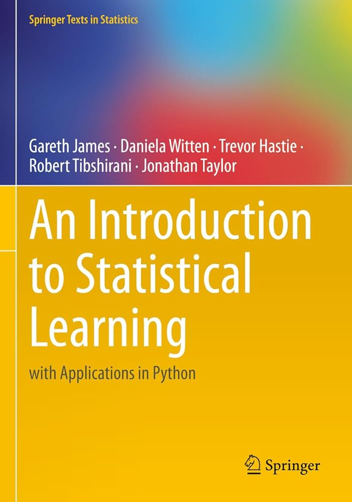

# Project `ISLP`

  

## 1: Overview

**Statistical-Learning** is a personal learning repository built around the book [*An Introduction to Statistical Learning with Python*](https://www.statlearning.com/). This project documents my deep dive into statistical learning, combining theoretical concepts with practical coding exercises.

The goal is to gain both **intuitive understanding** and **hands-on proficiency** in statistical and machine learning methods.

## 2: Repository Structure

- `ch##-topic/` folders contains:
    - `ch##-topic-lab.ipynb` - This is the lab written by the authors of ISLP
    - `ch##_exercises.ipynb` - This is the code with the end of chapter *applied questions*. 
- `data/` - Contains all of the data for ILSP (downloaded from the website)
- `images/` - Contains source images

## 3: Topics Covered (WIP)

- ✅ Chapter 1: Introduction
- ✅ Chapter 2: Statistical Learning
- ✅ Chapter 3: Linear Regression
- ⏳ Chapter 4: Classification
- 🔜 Chapter 5: Resampling Methods
- 🔜 Chapter 6: Linear Model Selection and Regularization
- 🔜 Chapter 7: Moving Beyond Linearity
- ⏳ Chapter 8: Tree-Based Methods
- 🔜 Chapter 9: Support Vector Machines
- 🔜 Chapter 10: Unsupervised Learning

## 4: Status

This is an **ongoing self-study project**. Progress is being made chapter by chapter. Contributions, discussions, or suggestions are always welcome via issues or pull requests. This project was last edited in *summer 2025*.

## 5: About Me

Created by *Spencer Venancio* — a statistics, math, and data science major passionate about gaining a deep understanding of modern machine learning algorithms.